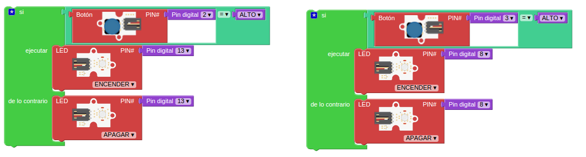

* * *

# Curso básico de Arduino

### José Antonio Vacas @javacasm

* * *

# Arduino

## Así lo vemos nosotros

[más detalle](imagenes/ArduinoUno_R3_Front.jpg)

* * *

## Así es internamente
#### (mucho por descubrir)

* * *

# Para hacer un proyecto necesitamos:

* ### Programa

* ### Montaje

#### (descargar el programa en la placa)

* * *

### ¿Qué es un programa? un conjunto de instrucciones ordenadas

#### Programa parpadeo (blink)

* Encendemos
* Esperamos
* Apagamos
* Esperamos
* Volvemos al principio

* * *

## Programando con Bitbloq

### http://bitbloq.bq.com

#### [Instalación del IDE de arduino](http://www.slideshare.net/javacasm/32-instalacin-del-ide)

Bitbloq es un entorno de programación visual que nos permite hacer pogramas para Arduino sin tener conocimientos de programación.

Un programa estará formado un conjunto de bloques que encajan entre sí.

Los bloques están agrupados en familias, cada una de ellas con un color concreto.

Existen 2 tipos de bloques:

* Los que llevan asociado un componente electrónico. Entre los primeros están todos los incluidos los bloques de las familias **Octupus** o **Zum** o la familia de los Servos. En ellos están los típicos bloques **Led**, **Pulsador**, **Potenciómetro**, **Sensor de luz**, etc. 
	Todos estos bloques necesitan que les asignemos un pin de la placa que será al que estén conectados y que incluiremos en el conector **#PIN**.

* Los bloques de programación son los que nos permiten decidir el modo en el que se ejecuta nuestro programa, haciendo que una parte se repita un número de veces o dependiendo del estado de un sensor se ejecute o no un grupo de instrucciones. En la imagen estamos viendo los bloques de control para hacer esperas o bucles.

Todos los bloques tienen unos conectores que encajan entre sí y que nos permiten conectarlos a los demás. Los conectores superior e inferior nos permiten establecer el orden en el que ejecutarán.

Los conectores laterales de la derecha o izquierda nos dicen si el bloque necesita una información o si la proporciona.

Así, los bloques que tiene un conector a la izquierda saliente nos proporcionan una información: un valor si es una constante, la lectura de un sensor, etc. En la imagen se ve un sensor de ultrasonidos que nos proporciona información de distancia hasta un obstáculo.

Los que tienen un conector entrante a la derecha necesitan de esa información para funcionar. Por ejemplo todos los bloques de hardware tienen al menos un conector porque necesitan un pin de la placa al que conectarse

* * *

## Programa parpadeo

Vamos a utilizar algunos de estos bloques para hacer un programa sencillo que haga parpadear un led.

Vemos que hemos utilizado 2 bloques Led, no hay que entender que se necesitan 2 leds, si no que le damos 2 órdenes distintas (encender y apagar)

* * *

### Usaremos el led interno

#### Ejercicio: Cambiar la velocidad de parpadeo

* * * 

## Con led externo

### Montaje sencillo

[detalle led](imagenes/300px-LED.png)

* * *
### Montaje con placa prototipo

[¿cómo funciona una placa prototipo?](imagenes/breadboard1.gif)

#### Ejercicio: Cambiar el pin utilizado al pin 2

* * *
	
### Esquema eléctrico

* * *

## Con un relé usaremos ¡¡grandes corrientes eléctricas!!

#### Ejercicio: Cambiar al pin del esquema

* * * 
## Veamos un poco de código

	void setup()  				// Función de configuración
	{
	  pinMode(13,OUTPUT);  		// Vamos a usar una salida
	}

	void loop()  // Función de bucle. Se repite por siempre
	{
	  digitalWrite(13,HIGH);  	// Activamos la salida 13
	  delay(1000);				// Esperamos
	  digitalWrite(13,LOW);		// Desativamos la salida 13
	  delay(1000);				// Esperamos
	}							// Cuando termina se vuelve a llamar

#### Ejercicio: Cambiar al pin del esquema
#### Ejercicio: Cambiar el pin utilizado al pin 2

* * *
## Semáforo

2 leds (rojo y verde) se alternan con un tiempo de espera entre ellos

Como queremos que el código sea claro usaremos una variable para indicar el pin al que está conectado cada led.

* LED Rojo encendido y Verde apagado
* Esperamos un tiempo (EsperaEnRojo)
* LED Rojo apagado y Verde encendido
* Esperamos un tiempo (EsperaEnVerde)

* * *

## Semáforo con bitbloq

* * *
## Semáforo con código

	setup()
	{ pinMode(ledverde,OUTPUT);
	  pinMode(ledrojo,OUTPUT);
	}

	void loop()
	{ int esperaVerde=1000;
	  int esperaRojo=500;
	  digitalWrite(ledverde,LOW);
	  digitalWrite(ledrojo,HIGH);
	  delay(esperaVerde);
	  digitalWrite(ledrojo,LOW);
	  digitalWrite(ledverde,HIGH);
	  delay(esperaRojo);
	} 

* * *
## Montaje semáforo

* * *

# KIT (registro de desplazamiento)
#### Vamos a encender varios leds de forma consecutiva imitando el efecto que hacía Kit, el coche fantástico

Usaremos una variable que nos irá diciendo el led que se ha de encender en cada paso.

### montaje

* * *
# Variables globales

Vamos a usar variables globales. Su principal característica es que mantienen su valor en todo el programa y por tanto entre las distintas interaciones.

* ContadorVueltas nos dirá el número de iteraciones que ha hecho nuestro programa
* Espera irá incrementando su valor para hacer cada vez más lento el proceso

Para modificar el valor usaremos el bloque de operaciones aritméticas que nos permite calcular el nuevo valor de la variable "espera"

* * *
## Números aleatorios

Podemos generar valores aleaotrios con el bloque "Aleatorio" al que le diremos entre qué valores ha de generar los valores. El valor máximo no se alcanza, por lo que si queremos que se incluya tendremos que incrementar el máximo.

Este programa llamado "Discotequero" hace parpadear los leds aleatoriamente durante un tiempo también aleatorio

* * *
# Lectura de datos analógicos

* ## Sensores (luz, temperatura)

* ## Potenciómetro: resistencia variable (mando de volumen)

### Se leen valores enteros entre 0 y 1023
### Equivalen a los valores de 0V y 5V

Cambiaremos nuestro programa "Aleatorio" para que el tiempo de espera con el led encendido sea proporcional al valor de espera del led encendido

* * *

En muchas ocasiones necesitamos hacer la transformación al rango que a nosotros nos interesa. Para simplificarlo usamos las funciones matemáticas **map**

* La primera es una versión simplificada que nos convierte un valor de una entrada analógica (entre 0 y 1023) al rango 0-N que elijamos

* La segunda nos permite hacer una transformación entre un rango y otro, cualquiera que sean los valores de estos.

Vamos a modificar el programa "Aleatorio" definiendo el valor de espera en el rango que queramos

* * *

## Voltímetro

Vamos a modificar este programa para hacer un voltímetro.

Para ello necesitamos usar números con decimales por lo que haremos el cambio en el entorno de Arduino

	void setup()
	{
	  Serial.begin(9600);
	}

	void loop()
	{
	  int Led=random(8,14);
	  int ValorPotenciometro=analogRead(A0);
	  int Espera=map(ValorPotenciometro,0,1023,200,500);
	  float Voltios=map(ValorPotenciometro,0,1023,0,5000)/1000.0;  // Es la línea anterior modificado
	  pinMode(Led,OUTPUT);
	  digitalWrite(Led,HIGH);
	  delay(Espera);
	  pinMode(Led,OUTPUT);
	  digitalWrite(Led,LOW);
	  Serial.print(Voltios);   // Enviamos el valor al PC
	  Serial.println("v");
	}

* * *

## Sentencias condicionales

Una sentencia condicional es la que nos permite decidir si hacemos o no un bloque según una condición lógica

* * *

# Pulsaciones: botones

## Montaje 

## Programa

### Usamos una sentencia condicional: si se cumple esto...se hace aquello

### Su código

	void setup()
	{
	  pinMode(2,INPUT_PULLUP);  // Usamos 2 como entrada
	  pinMode(13,OUTPUT);		// Usamos 13 como salida
	}

	void loop()
	{
	  if (digitalRead(2) == HIGH)  	// Si el pulsador está pulsado
	  {
	    digitalWrite(13,HIGH);		//Encendemos el led 13
	  }
	  else 							// Si NO se cumple
	  {		
	    digitalWrite(13,LOW);		// Lo apagamos
	  }
	}

* * *
## 2 Pulsadores

Vamos usar 2 pulsadores para mover el led que encenderemos: un pulsador hará que se encienda el led anterior, el otro hará que se encienda el siguiente.

Para ello haremos el siguiente montaje con 6 leds (con resistencias de 330 Ohmios)y 2 pulsadores (con resistencias de 10k)

### Paso 1: 2 pulsadores encienden 2 leds

Empezaremos haciendo un programa que controle 2 leds con 2 pulsadores: cada uno enciende un led

### Paso 2: 2 pulsadores que irán encendiendo el led siguiente o el anterior

Utilizamos una variable que vamos incrementando con un pulsador y con otro decrementamos

(Hay que controlar que cuando lleguemos a un extremo no nos pasemos)

Se añade un retardo para evitar que se detecten varias pulsaciones.

Vemos que hay muchos bloque que se repiten, por lo que para facilitarlo definiremos funciones.

* * *
# Funciones

Cuando tenemos un conjunto de instrucciones que se repiten a lo largo del código podemos hacer nuestro programa más simple creando una ** Función **

## Función: 

	Conjunto de instrucciones que empaquetamos en un bloque y que podemos llamar desde cualquier parte de nuestro código. 
	
	* Todas las funciones tienen 1 nombre que con el que se definen

	* Una función puede devolver un valor a quien la llama o no

	* A una función le podemos pasar un argumento, una variable que usará nuestra función para realizar su cometido

Podemos llamar a una función desde cualquier parte de nuestro código.

* * * 
# Escritura de valores analógicos

## Usando técnicas como PWM podemos simular valores intermedios: 0 - 255
### (sólo en algunos pines ~ )

## Como vamos a hacer que cambie de valor usaremos una variable

### Si vemos el código

	void setup()						// configuracion
	{
	  pinMode(9,OUTPUT);				// Usaremos la patilla 5 como salida
	  
	}

	void loop()
	{
	  int valorSalida=0;				// la variable valorSalida empieza en 0
	  while (valorSalida < 256) {		// Haremos el bucle hasta que llegemos a 256
	    analogWrite(9,valorSalida);		// pasamos el valor a la patilla 5
	    delay(100);						// Esperamos 0,1 segundos
	   }

	}

* * *
# Led RGB
## 3 leds (Red,Green,Blue) con una de las patillas común

## Positivo (Ánodo) Común

## Negativo (Cátodo) Común

## Tiras de leds: Necesitamos más potencia por lo que usaremos un transistor como amplificador.

### El montaje es sencillo

[Introducción a la electrónica](http://www.slideshare.net/javacasm/40-introduccin-a-la-electrnica)

* * * 
# Potenciómetro regulando una salida analógica

### El código:

	void setup()
	{
	  pinMode(5,OUTPUT);
	}

	void loop()
	{
	  int valorPotenciometro=analogRead(0);				 	// Leemos el valor
	  int ValorSalida=map(valorPotenciometro,0,1023,0,255);	// Convertimos al rango de salida
	  analogWrite(5,ValorSalida);							// Escribimos el valor en la salida
	}

### Ejercicio: usar 3 potenciómetros para controlar los colores de un led RGB

* * *

# Envío de datos serie

### La comunicación serie se produce via USB entre Arduino y el PC

* Detectamos el puerto
* Configuramos la velocidad
* Necesitamos un programa para ver los datos

## Vamos a enviar "Encendido" y "Apagado" al PC

* * * 
# Números decimales

Usaremos el tipo de variable float

### Ejemplo: Voltímetro
* Leemos el valor de un potenciómetro conectado a una entrada analógica (A0)
* Convertimos el valor (0-1023) a 0 - 5.0v
* Sacamos el valor por la consola serie

* Calibramos viendo los extremos y el valor intermedio 3.3V

	const int analogInPin = A0;  // Entrada analógica
	int sensorValue = 0;        // valor leído

	void setup() {
	  Serial.begin(9600); 
	}
	void loop() {
	  
	  sensorValue = analogRead(analogInPin);   // leemos el valor analógico
	  float voltios=(5.0*sensorValue) /1023;   // Lo convertimos
	  Serial.print("sensor = " );                       
	  Serial.print(sensorValue);    
	  Serial.print(" = ");
	  Serial.print(voltios);
	  Serial.println("v");   
	   delay(200);                     
	}

* * * 
# Sensores

## Para los sensores tenemos que seguir los pasos

* Haremos la lectura
* Conversiones: traducimos a valores físicos (aritmética/mapeo) según el fabricante
* Calibraciones: establecemos valores de referencia

[Introducción a la electrónica](http://www.slideshare.net/javacasm/40-introduccin-a-la-electrnica) [Sensores](http://www.slideshare.net/javacasm/46-sensores)

* * *
# Sensor de temperatura LM35: viene calibrado y linealizado

## Usamos la fórmula del fabricante

	temperatura = valorAnalogico*5*100/1024 

[pinout lm35](imagenes/tmp36pinout.gif)

* * * 
## El código quedaría así:

### Enviaremos el dato leído al pc con la función __Serial__

	int sensorPin=A0;

	void setup()
	{
		Serial.begin(9600);  // Configuramos la conexión
	}

	void loop()
	{
		int sensorValue= analogRead(sensorPin);  // Leemos el valor analógico
		float temperatura=(sensorValue*5*100)/1024; // float para tener decimales
		Serial.println(temperatura);			// Enviamos el dato al PC
		delay(1000);
	}

* * *
# Librerías: conjunto de código empaquetado

Ejemplo: [lcd](http://arduino.cc/en/pmwiki.php?n=Reference/LiquidCrystal) o [servo](http://arduino.cc/en/pmwiki.php?n=Reference/Servo)

### Para incluir una librería en código hacemos

	#include <Libreria.h>

* * * 
# Servo

### Los servos son motores capaces de mantener una posición angular. 
### Se les dice él ángulo que deben formar

##### (también hay servos que pueden girar todo lo que quieran)

* * * 

### El código

	#include <Servo.h>  // Incluimos la librería

	Servo servo;       // Declaramos que vamos a usar 1 servo

	void setup()
	{
	  servo.attach(7); // Configuramos el servo conectado al pin 7
	}

	void loop()
	{
	  int valorPotenciometro=analogRead(A0); 					// Leemos el potenciometro
	  int PosicionServo=map(valorPotenciometro,0,1023,0,180);	// Reescalamos el valor
	  servo.write(valorPotenciometro);							// Le pedimos que gira hasta ese ángulo
	  delay(50);												// Le damos tiempo para que complete el giro
	
}
## Oscilación servo

Podemos utilizar un bucle para hacer que el servo oscile entre las posiciones extremas

#### [Más sobre servos](http://www.slideshare.net/javacasm/arduino-prctico-servos)

* * *

# LCD

### Existen varias librerías:

* [Librería LCD MF](https://bitbucket.org/fmalpartida/new-liquidcrystal/wiki/Home)
* [Ejemplos lcd](http://arduino-info.wikispaces.com/LCD-Blue-I2C#v3)
* [Ejemplo bq](http://diwo.bq.com/programando-lcd/)

### Usaremos lcd I2C

* Descargamos de su [origen](http://www.4tronix.co.uk/arduino/sketches/LiquidCrystal_V1.2.1.zip)
* Descomprimimos en la carpeta **arduino/libraries**

### Montaje

### Código

	#include <Wire.h>
	#include <LiquidCrystal.h>

	LiquidCrystal lcd(0x27);  // El fabricante nos debe decir la dirección

	void setup()
	{
	  lcd.begin(16, 2);  //Geometria del lcd
	  lcd.clear();

	}

	void loop()
	{
	  lcd.setCursor(0,0);  		// Nos movemos a la posición
	  lcd.print("Hola Mundo");	// Mostramos un texto

	}

* * *
# Proyecto: termostato configurable y que activa un relé

[Proyecto 1](https://arduinolab.wordpress.com/)

[Proyecto 2](http://www.electroschematics.com/8998/arduino-temperature-controlled-relay/)

## Veamos los componentes:

* Sensor lm35 conectado a A0
* Potenciómetro conectado a A1
* Relé conectado a D7
* LCD conectado a A4 y A5

## Programa

Comparamos el valor leido del potenciómetro con el leído del potenciómetro.
Si este es máyor activamos el relé
Mostramos en el lcd la temperatura actual

* * *
### ¿Dónde comprar?

Ante todo hay que mirar lo que se compra y la documentación e información que se incluye.

# Españolas

[Electan](http://www.electan.com/)

[Cooking Hacks](http://www.cooking-hacks.com/)

[Bricogeek](http://tienda.bricogeek.com/)

[Bq](http://www.bq.com/es/productos/kit-robotica.html)

***

# Internacionales

[Sparkfun](https://www.sparkfun.com/)

[Adafruit](http://www.adafruit.com/)

[SeedStudio](http://www.seeedstudio.com)

# Internacionales baratas

[Elecfreaks](http://www.elecfreaks.com/)

[EletroDragon](http://www.electrodragon.com/)

# Baratas (bazares)

[DX](http://www.dx.com/s/arduino)

* * *

# Agradecimientos:

[Arduino](http://arduino.cc)

[Adafruit](http://adafruit.com)

[Sparkfun](http://sparkfun.com)

[wikipedia](http://es.wikipedia.org)

[José Pujol](https://tecnopujol.wordpress.com)