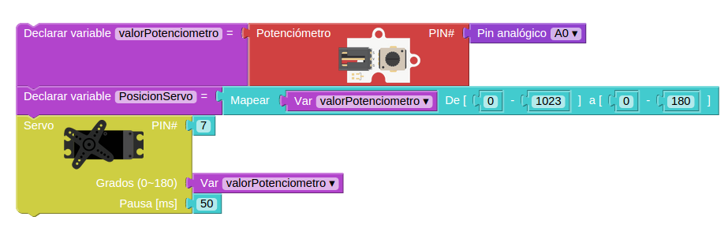

* * *

# Curso básico de Arduino

### José Antonio Vacas @javacasm

* * *

# Arduino

## Así lo vemos nosotros

[más detalle](imagenes/ArduinoUno_R3_Front.jpg)

* * *

## Así es internamente
#### (mucho por descubrir)

* * *

# Para hacer un proyecto necesitamos:

* ### Programa

* ### Montaje

#### (descargar el programa en la placa)

* * *

### ¿Qué es un programa? un conjunto de instrucciones ordenadas

#### Programa parpadeo (blink)

* Encendemos
* Esperamos
* Apagamos
* Esperamos
* Volvemos al principio

* * *

## Programando con Bitbloq

### http://bitbloq.bq.com

#### [Instalación del IDE de arduino](http://www.slideshare.net/javacasm/32-instalacin-del-ide)

Programa parpadeo

* * *

### Usaremos el led interno

#### Ejercicio: Cambiar la velocidad de parpadeo

* * * 

## Con led externo

### Montaje sencillo

[detalle led](imagenes/300px-LED.png)

* * *
### Montaje con placa prototipo

[¿cómo funciona una placa prototipo?](imagenes/breadboard1.gif)

#### Ejercicio: Cambiar el pin utilizado al pin 2

* * *
	
### Esquema eléctrico

* * *

## Con un relé usaremos ¡¡grandes corrientes eléctricas!!

#### Ejercicio: Cambiar al pin del esquema

* * * 
## Veamos un poco de código

	void setup()  				// Función de configuración
	{
	  pinMode(13,OUTPUT);  		// Vamos a usar una salida
	}

	void loop()  // Función de bucle. Se repite por siempre
	{
	  digitalWrite(13,HIGH);  	// Activamos la salida 13
	  delay(1000);				// Esperamos
	  digitalWrite(13,LOW);		// Desativamos la salida 13
	  delay(1000);				// Esperamos
	}							// Cuando termina se vuelve a llamar

#### Ejercicio: Cambiar al pin del esquema
#### Ejercicio: Cambiar el pin utilizado al pin 2

* * * 
# Envío de datos serie

### La comunicación serie se produce via USB entre Arduino y el PC

* Detectamos el puerto
* Configuramos la velocidad
* Necesitamos un programa para ver los datos

## Vamos a enviar "Encendido" y "Apagado" al PC

* * * 
# Escritura de valores analógicos

## Usando técnicas como PWM podemos simular valores intermedios: 0 - 255
### (sólo en algunos pines ~ )

## Como vamos a hacer que cambie de valor usaremos una variable

### Si vemos el código

	void setup()						// configuracion
	{
	  pinMode(9,OUTPUT);				// Usaremos la patilla 5 como salida
	  Serial.begin(9600);				// Configuramos la conexión con el PC
	}

	void loop()
	{
	  int valorSalida=0;				// la variable valorSalida empieza en 0
	  while (valorSalida < 256) {		// Haremos el bucle hasta que llegemos a 256
	    analogWrite(9,valorSalida);		// pasamos el valor a la patilla 5
	    Serial.println(valorSalida);	// Enviamos al pc la variable
	    delay(100);						// Esperamos 0,1 segundos
	   }

	}

* * *
# Led RGB
## 3 leds (Red,Green,Blue) con una de las patillas común

## Positivo (Ánodo) Común

## Negativo (Cátodo) Común

## Tiras de leds: Necesitamos más potencia por lo que usaremos un transistor como amplificador.

### El montaje es sencillo

[Introducción a la electrónica](http://www.slideshare.net/javacasm/40-introduccin-a-la-electrnica)

* * *

# Lectura de datos analógicos

* ## Sensores (luz, temperatura)

* ## Potenciómetro: resistencia variable (mando de volumen)

### Se leen valores enteros entre 0 y 1023
### Equivalen a los valores de 0V y 5V

* * * 
# Potenciómetro regulando una salida analógica

### El código:

	void setup()
	{
	  pinMode(5,OUTPUT);
	}

	void loop()
	{
	  int valorPotenciometro=analogRead(0);				 	// Leemos el valor
	  int ValorSalida=map(valorPotenciometro,0,1023,0,255);	// Convertimos al rango de salida
	  analogWrite(5,ValorSalida);							// Escribimos el valor en la salida
	}

### Ejercicio: usar 3 potenciómetros para controlar los colores de un led RGB

* * * 
# Sensores

## Para los sensores tenemos que seguir los pasos

* Haremos la lectura
* Conversiones: traducimos a valores físicos (aritmética/mapeo) según el fabricante
* Calibraciones: establecemos valores de referencia

[Introducción a la electrónica](http://www.slideshare.net/javacasm/40-introduccin-a-la-electrnica) [Sensores](http://www.slideshare.net/javacasm/46-sensores)

* * *
# Sensor de temperatura LM35: viene calibrado y linealizado

## Usamos la fórmula del fabricante

	temperatura = valorAnalogico*5*100/1024 

[pinout lm35](imagenes/tmp36pinout.gif)

* * * 
## El código quedaría así:

### Enviaremos el dato leído al pc con la función __Serial__

	int sensorPin=A0;

	void setup()
	{
		Serial.begin(9600);  // Configuramos la conexión
	}

	void loop()
	{
		int sensorValue= analogRead(sensorPin);  // Leemos el valor analógico
		float temperatura=(sensorValue*5*100)/1024; // float para tener decimales
		Serial.println(temperatura);			// Enviamos el dato al PC
		delay(1000);
	}

* * *

# Pulsaciones: botones

## Montaje 

## Programa

### Usamos una sentencia condicional: si se cumple esto...se hace aquello

### Su código

	void setup()
	{
	  pinMode(2,INPUT_PULLUP);  // Usamos 2 como entrada
	  pinMode(13,OUTPUT);		// Usamos 13 como salida
	}

	void loop()
	{
	  if (digitalRead(2) == HIGH)  	// Si el pulsador está pulsado
	  {
	    digitalWrite(13,HIGH);		//Encendemos el led 13
	  }
	  else 							// Si NO se cumple
	  {		
	    digitalWrite(13,LOW);		// Lo apagamos
	  }
	}

* * *
# Librerías: conjunto de código empaquetado

Ejemplo: [lcd](http://arduino.cc/en/pmwiki.php?n=Reference/LiquidCrystal) o [servo](http://arduino.cc/en/pmwiki.php?n=Reference/Servo)

### Para incluir una librería en código hacemos

	#include <Libreria.h>

* * * 
# Servo

### Los servos son motores capaces de mantener una posición angular. 
### Se les dice él ángulo que deben formar

##### (también hay servos que pueden girar todo lo que quieran)

* * * 

### El código

	#include <Servo.h>  // Incluimos la librería

	Servo servo;       // Declaramos que vamos a usar 1 servo

	void setup()
	{
	  servo.attach(7); // Configuramos el servo conectado al pin 7
	}

	void loop()
	{
	  int valorPotenciometro=analogRead(A0); 					// Leemos el potenciometro
	  int PosicionServo=map(valorPotenciometro,0,1023,0,180);	// Reescalamos el valor
	  servo.write(valorPotenciometro);							// Le pedimos que gira hasta ese ángulo
	  delay(50);												// Le damos tiempo para que complete el giro
	}

#### [Más sobre servos](http://www.slideshare.net/javacasm/arduino-prctico-servos)

* * *

# LCD

### Existen varias librerías:

* [Librería LCD MF](https://bitbucket.org/fmalpartida/new-liquidcrystal/wiki/Home)
* [Ejemplos lcd](http://arduino-info.wikispaces.com/LCD-Blue-I2C#v3)
* [Ejemplo bq](http://diwo.bq.com/programando-lcd/)

### Usaremos lcd I2C

* Descargamos de su [origen](http://www.4tronix.co.uk/arduino/sketches/LiquidCrystal_V1.2.1.zip)
* Descomprimimos en la carpeta **arduino/libraries**

### Montaje

### Código

	#include <Wire.h>
	#include <LiquidCrystal.h>

	LiquidCrystal lcd(0x27);  // El fabricante nos debe decir la dirección

	void setup()
	{
	  lcd.begin(16, 2);  //Geometria del lcd
	  lcd.clear();

	}

	void loop()
	{
	  lcd.setCursor(0,0);  		// Nos movemos a la posición
	  lcd.print("Hola Mundo");	// Mostramos un texto

	}

* * *
# Proyecto: termostato configurable y que activa un relé

[Proyecto 1](https://arduinolab.wordpress.com/)

[Proyecto 2](http://www.electroschematics.com/8998/arduino-temperature-controlled-relay/)

## Veamos los componentes:

* Sensor lm35 conectado a A0
* Potenciómetro conectado a A1
* Relé conectado a D7
* LCD conectado a A4 y A5

## Programa

Comparamos el valor leido del potenciómetro con el leído del potenciómetro.
Si este es máyor activamos el relé
Mostramos en el lcd la temperatura actual

* * *

# Agradecimientos:

[Arduino](http://arduino.cc)

[Adafruit](http://adafruit.com)

[Sparkfun](http://sparkfun.com)

[wikipedia](http://es.wikipedia.org)

[José Pujol](https://tecnopujol.wordpress.com)